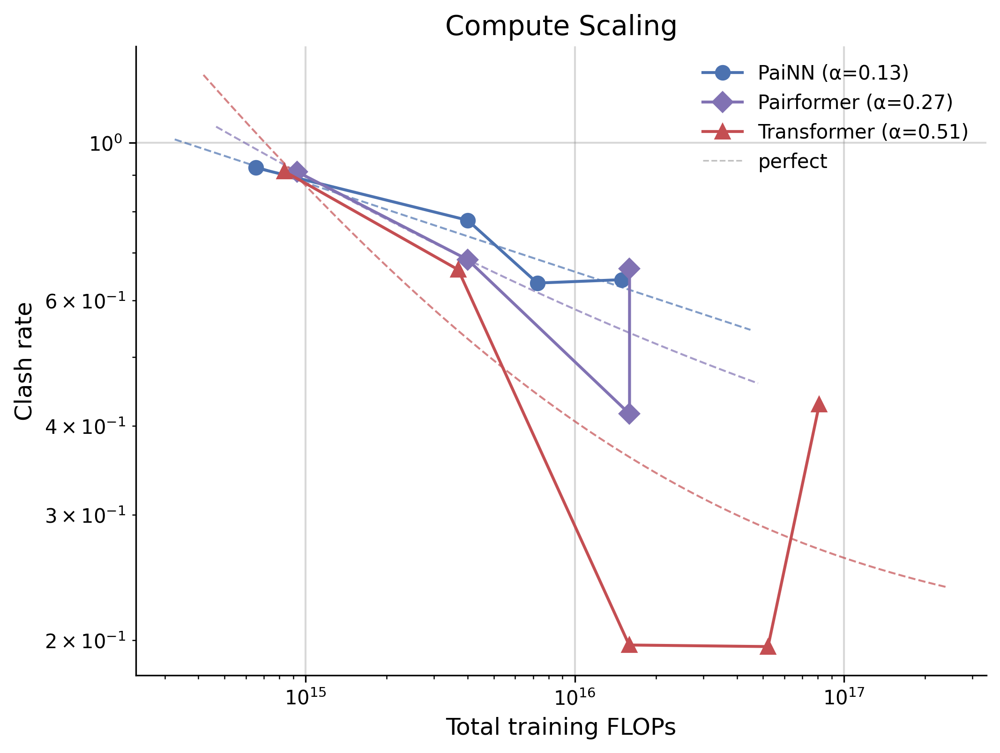
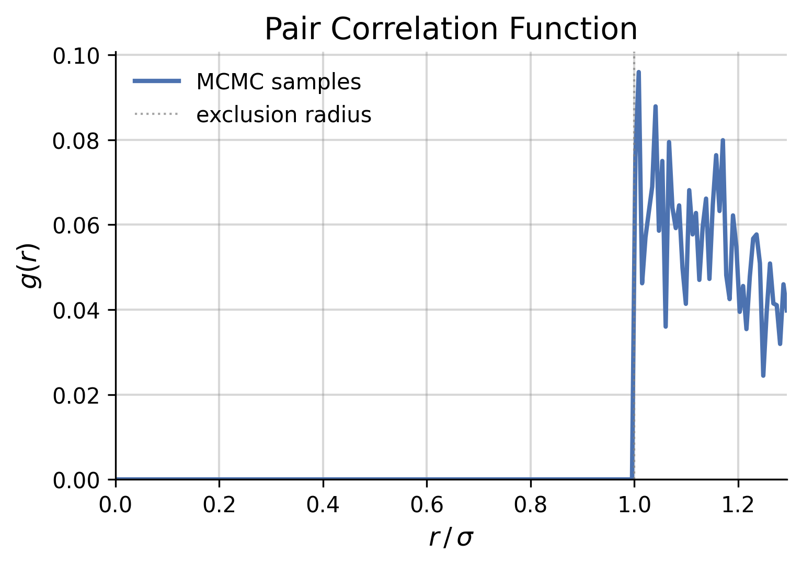

<p align="center">
  
</p>

# SynthBench3D

**Scaling laws for 3D generative models via synthetic benchmarks.** Compare GNN, Transformer, and Pairformer architectures on controlled geometric tasks to predict which will scale best for 3D structure foundation models.

## Why synthetic benchmarks?

Real molecular data is expensive and confounded — you can't isolate *why* one model beats another. SynthBench3D builds synthetic tasks with known ground truth (starting with hard sphere packing) where the only challenge is a single geometric constraint. By measuring how each architecture's performance improves with compute, we extract **scaling exponents** that predict which architectures will dominate at foundation-model scale — actionable information you can't get from standard benchmarks.

## Key Result: Compute Scaling Laws

For each architecture, we sweep model size and training steps under a fixed compute budget, then fit a power law: `clash_rate(C) = a × C^(-α) + floor`. The scaling exponent **α** tells you how fast performance improves with compute.

<p align="center">
  
</p>

## Architectures

| Architecture | Type | Equivariant? | Reference |
|---|---|---|---|
| **PaiNN** | Equivariant GNN | Yes | [Schütt et al., 2021](https://arxiv.org/abs/2102.03150) |
| **Transformer** | Global attention | No (augmentation) | [SimpleFold (Apple, 2025)](https://arxiv.org/abs/2503.11533) |
| **Pairformer** | Pair + triangle updates | No (augmentation) | [Boltz (Wohlwend et al., 2024)](https://arxiv.org/abs/2408.00778) |

All architectures share the same **conditional flow matching** framework — the only variable is the velocity network. Same training data, same ODE sampler, same evaluation.

## Data

MCMC (Metropolis-Hastings) sampler generates non-overlapping sphere configurations in a cubic box. Difficulty controlled by packing fraction η = N·(4/3)πr³/L³. We validate samples via the pair correlation function g(r), which should show zero density below the exclusion diameter.

<p align="center">
  
</p>

## Quick Start

```bash
# Install dependencies
uv sync

# Generate training data (N=10, η=0.3)
uv run data/generate.py --N 10 --eta 0.3 --radius 0.5 \
    --num_samples 50000 --output outputs/data/N10_eta0.3/train.npz

# Train a PaiNN model
uv run experiments/train.py model=painn data=default training.max_steps=50000

# Evaluate (generate samples + compute clash rate)
uv run experiments/evaluate.py --checkpoint outputs/checkpoints/painn/best.pt \
    --arch painn --num_samples 10000

# Run compute-matched scaling experiment
uv run experiments/scaling.py run --arch painn --budgets 1e15 4e15 1.6e16
```

> Regenerate README figures: `uv run docs/assets/generate_readme_figures.py`

## Project Structure

```
├── data/               # MCMC sampler + PyTorch dataset
├── models/             # PaiNN, Transformer, Pairformer velocity networks
├── flow_matching/      # Shared interpolation, training loss, ODE sampling
├── metrics/            # Clash rate computation
├── experiments/        # Training, evaluation, scaling sweeps
├── viz/                # Publication-quality plotting
├── configs/            # Hydra configuration files
└── outputs/            # All generated artifacts (gitignored)
```

## Documentation

- [Research big picture](docs/big_picture.md) — why synthetic benchmarks, the broader research program
- [Project description](docs/project_description.md) — detailed task specification and methodology

## Tech Stack

Python · PyTorch · Hydra · W&B · uv
