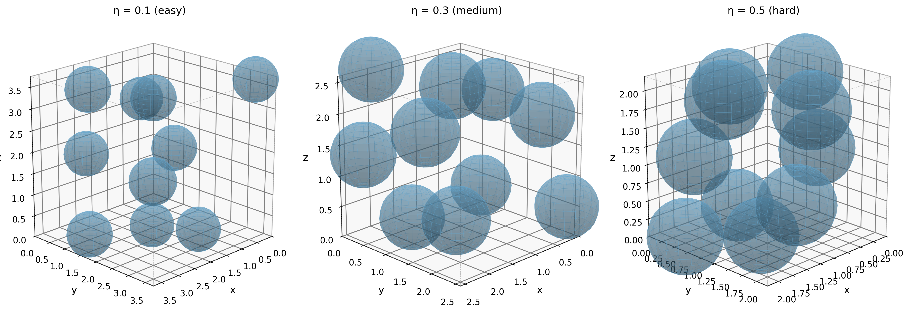
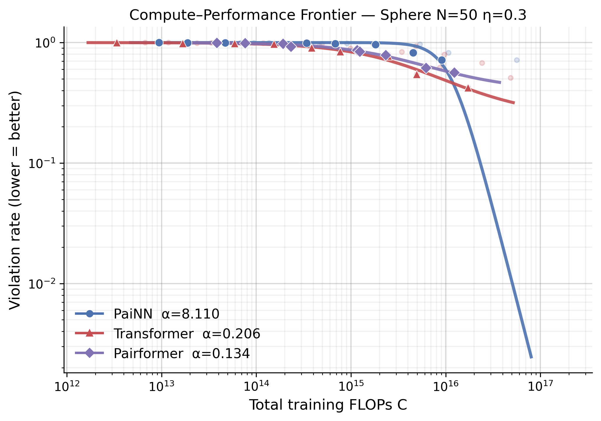
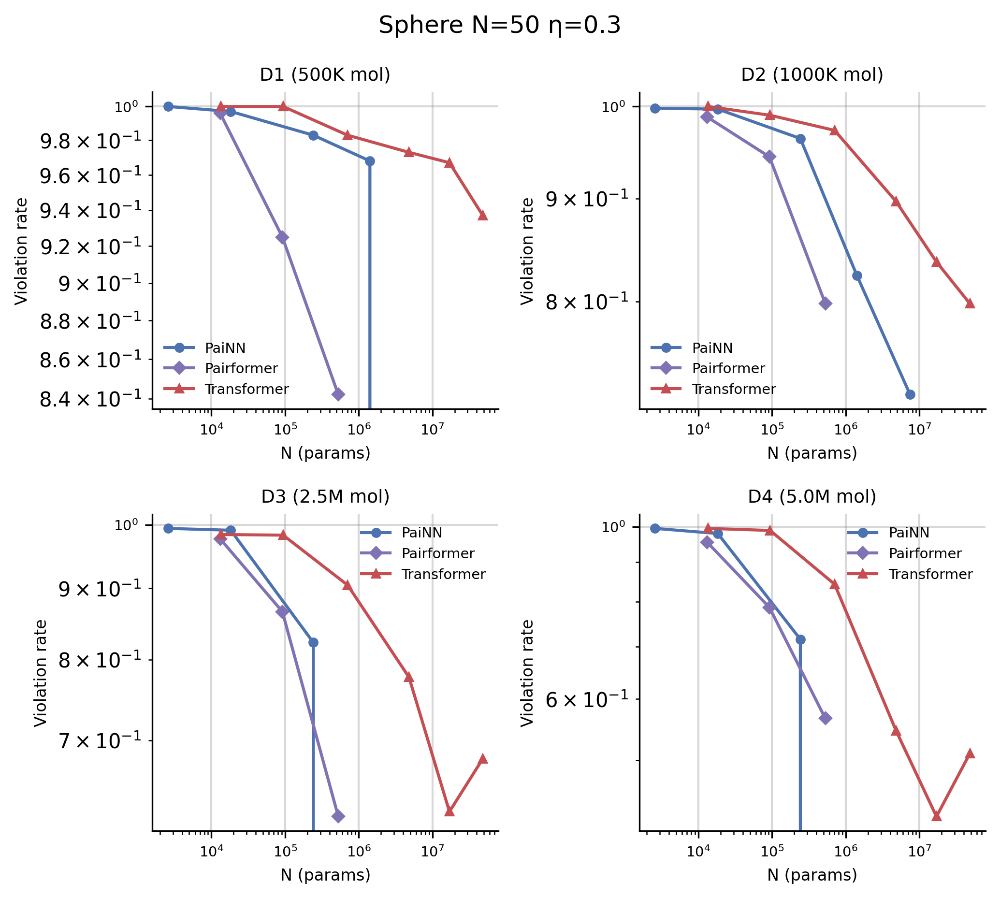
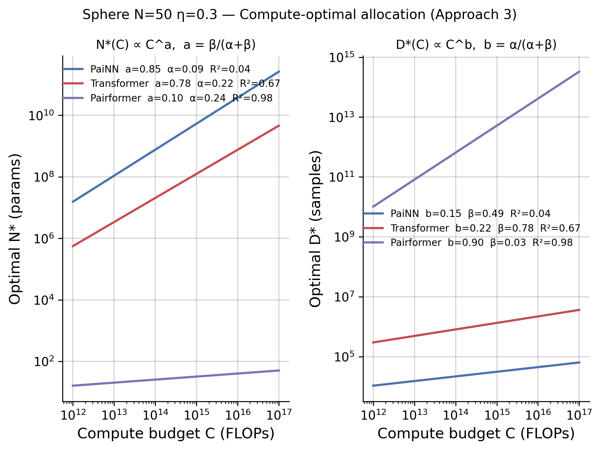

# SynthBench3D

**Chinchilla-style scaling laws for 3D generative models via synthetic benchmarks.**

Compare GNN (PaiNN), Transformer, and Pairformer architectures on controlled geometric tasks using conditional flow matching. By fitting L(N,D) = E + A/N^α + B/D^β, we extract compute-optimal allocation exponents that predict which architecture will dominate at foundation-model scale.

<p align="center">
  
</p>

## Motivation

Real molecular data is expensive and confounded — you can't isolate *why* one model beats another. SynthBench3D builds synthetic tasks with known ground truth where the only challenge is a single geometric constraint. Chinchilla-style scaling experiments on these tasks give actionable architecture selection guidance you can't get from standard benchmarks.

## Tasks

### Hard Sphere Packing

Non-overlapping sphere configurations in a cubic box. The only constraint is steric exclusion (|x_i - x_j| > 2r). Primary Chinchilla target at N=50 atoms (O(N²)=2500 attention pairs).

**Metric**: violation_rate (fraction of samples with any overlap)

### Self-Avoiding Chains

Polymer chains with fixed bond lengths that must not self-intersect. Adds sequential bonded constraints on top of clash avoidance.

**Metrics**: clash rate, bond length violation

### Unified Rule System

Progressive difficulty via 6 independently toggleable geometric rules:

| Rule | Constraint | What it tests |
|------|-----------|---------------|
| **R1** | Slot occupancy (VSEPR) | Local coordination geometry |
| **R2** | Bond angles (sp3/sp2) | Angular constraint satisfaction |
| **R3** | Bond lengths | Distance constraint learning |
| **R4** | Dihedral angles | Torsional energy landscape |
| **R5** | Global pair distances | Long-range contact prediction |
| **R6** | Periodicity / ring closure | Cyclic topology constraints |

Tasks are composed by combining rules: `unified_R123_sp3_N10` (rules 1-3), `unified_R12345_sp3_N20` (rules 1-5), etc. Per-rule violation rates enable fine-grained diagnosis of which geometric challenge each architecture struggles with.

## Chinchilla Scaling Experiments

We follow the Chinchilla methodology (Hoffmann et al., 2022) to find compute-optimal model size and data allocation for each architecture.

### Experimental Setup

- **Task**: sphere_N50 (N=50, η=0.3) — 2500 attention pairs make architecture differences meaningful
- **Architectures**: PaiNN, Transformer, Pairformer
- **Model sizes**: 5 log-spaced sizes (~2K–8M params) spanning underfit → optimal → overfit
- **Data budgets**: D1–D4 (500K–5M tokens), each trained for exactly 1 epoch
- **LR sweep**: 3 values (1e-5, 1e-4, 1e-3); best selected per (arch, size, D)
- **Total**: 90 independent training runs

### Approach 1: IsoFLOP Profiles

For each data budget, sweep model size and find the optimal N*(C) that minimizes violation rate at each compute level.

<p align="center">
  
</p>

<p align="center">
  
</p>

### Approach 3: Parametric Fit L(N, D)

Fit the Chinchilla power law per architecture:

```
L(N, D) = E + A / N^α + B / D^β
```

| | PaiNN | Transformer | Pairformer |
|---|:---:|:---:|:---:|
| **α** (model scaling) | 0.089 | 0.216 | 0.242 |
| **β** (data scaling) | 0.489 | 0.778 | 0.026 |
| **R²** (logit space) | 0.674 | 0.799 | 0.973 |
| **N_exponent** β/(α+β) | 0.845 | 0.783 | 0.099 |
| **D_exponent** α/(α+β) | 0.155 | 0.217 | 0.901 |

<p align="center">
  
</p>

### Key Findings

1. **Transformer scales best with data** (β=0.78): strongest data scaling combined with solid model scaling — improves steadily on both axes. Reaches the lowest violation rate (0.42) at D4.

2. **Pairformer saturates on data** (β=0.03): pair representations extract near-maximal structure from limited data, but more data barely helps. Best fit quality (R²=0.97) suggests this is a genuine architectural property, not noise.

3. **PaiNN is data-hungry but model-insensitive** (α=0.09, β=0.49): equivariant message passing benefits more from data diversity than model capacity at this scale.

4. **All architectures are data-limited**: optimal allocations are heavily biased toward D (N_exponent > 0.78 for PaiNN/Transformer), indicating the current data regime (≤5M tokens) is insufficient for convergence.

## Architectures

| Architecture | Type | Equivariant? | Reference |
|---|---|---|---|
| **PaiNN** | Equivariant GNN | Yes | [Schütt et al., 2021](https://arxiv.org/abs/2102.03150) |
| **Transformer** | Global attention | No (augmentation) | [SimpleFold, 2025](https://arxiv.org/abs/2503.11533) |
| **Pairformer** | Pair + triangle updates | No (augmentation) | [Boltz, 2024](https://arxiv.org/abs/2408.00778) |

All architectures share the same conditional flow matching framework — the only variable is the velocity network.

## Setup

```bash
# Requires Python >= 3.10 and uv
uv sync
```

## Usage

### Data Generation

```bash
# Hard spheres (N=50, packing fraction η=0.3)
uv run data/generate.py --N 50 --eta 0.3 --radius 0.5 \
    --num_samples 50000 --output outputs/data/N50_eta0.3/train.npz

# Unified rules (rules 1-3, sp3 geometry, 10 backbone atoms)
uv run data/generate_unified.py --rules 1,2,3 --N_backbone 10 \
    --n_samples 50000 --output outputs/data/unified_R123_sp3_N10/train.npz
```

### Training

```bash
uv run experiments/train.py model=painn data=medium_small train.max_steps=50000
```

### Chinchilla Scaling Experiments

```bash
# Full pipeline: generate → run → collect → fit → plot
uv run python experiments/chinchilla.py generate --tasks sphere_N50 --archs painn,transformer,pairformer
uv run python experiments/chinchilla.py run      --tasks sphere_N50 --n_gpus 4
uv run python experiments/chinchilla.py collect  --tasks sphere_N50
uv run python experiments/chinchilla.py fit      --tasks sphere_N50
uv run python experiments/chinchilla.py plot     --tasks sphere_N50

# Custom data budgets and multi-epoch training
uv run python experiments/chinchilla.py generate --tasks sphere_N50 \
    --d_targets 10000,20000,50000,100000 --epochs 50
```

## Project Structure

```
├── data/               # MCMC samplers + PyTorch datasets (sphere, chain, VSEPR, unified)
├── models/             # PaiNN, Transformer, Pairformer velocity networks
├── flow_matching/      # Interpolation, training loss, ODE sampling
├── metrics/            # Per-task metrics (clash, bond, VSEPR, unified rule violations)
├── experiments/
│   ├── chinchilla.py       # Chinchilla scaling CLI entry point
│   ├── chinchilla_lib/     # Modular package (config, generate, run, collect, fit, plot)
│   ├── task_registry.py    # Task definitions with complexity levels
│   ├── model_registry.py   # Architecture size presets (chinchilla_0–13)
│   ├── train.py            # Hydra-based training loop
│   └── scaling.py          # Compute-matched scaling sweeps
├── viz/                # Publication-quality plotting (scaling, chinchilla, structure)
├── configs/            # Hydra configs (20+ task definitions in configs/data/)
└── outputs/            # Generated artifacts (gitignored)
```

## Tech Stack

Python · PyTorch · Hydra · W&B · uv
