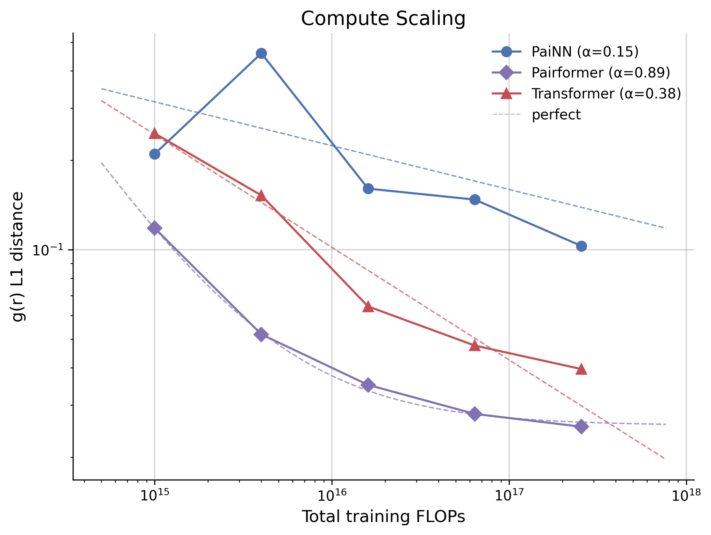

# SynthBench3D

**Scaling laws for 3D generative models via synthetic benchmarks.**

Compare GNN (PaiNN), Transformer, and Pairformer architectures on controlled geometric tasks using conditional flow matching. By measuring how each architecture's performance improves with compute, we extract scaling exponents that predict which will dominate at foundation-model scale.

<p align="center">
  
</p>

## Motivation

Real molecular data is expensive and confounded — you can't isolate *why* one model beats another. SynthBench3D builds synthetic tasks with known ground truth where the only challenge is a single geometric constraint. Measuring scaling exponents on these tasks gives actionable architecture selection guidance you can't get from standard benchmarks.

## Tasks

### Hard Sphere Packing

Non-overlapping sphere configurations in a cubic box. The only constraint is steric exclusion (|x_i - x_j| > 2r). Tests pairwise distance constraint learning.

**Metric**: clash rate (fraction of samples with any overlap)

### Self-Avoiding Chains

Polymer chains with fixed bond lengths that must not self-intersect. Adds sequential bonded constraints on top of clash avoidance. Difficulty scales exponentially with chain length.

**Metrics**: clash rate, bond length violation, g(r) distance

### Unified Rule System

Progressive difficulty via 6 independently toggleable geometric rules:
1. Clash avoidance
2. Bond length constraints
3. Bond angle (VSEPR sp3)
4. Dihedral angles
5. Ring closure
6. Cross-linking

## Scaling Results

### Hard Sphere Packing

<p align="center">
  
</p>

| | PaiNN | Transformer | Pairformer |
|---|:---:|:---:|:---:|
| **α** (clash rate) | **1.21** | 0.39 | 0.51 |

PaiNN's equivariant message passing scales fastest on the pure distance-constraint problem.

### Self-Avoiding Chains

<p align="center">
  
</p>

| | PaiNN | Transformer | Pairformer |
|---|:---:|:---:|:---:|
| **α** (g(r) distance) | 0.15 | 0.38 | **0.89** |
| **α** (clash rate) | 0.19 | 0.24 | **0.90** |

Pairformer's pair representation and triangular updates dominate when structure has sequential topology.

**Takeaway**: Architecture rankings flip between tasks — the "best" architecture depends on which geometric challenge dominates your problem.

## Architectures

| Architecture | Type | Equivariant? | Reference |
|---|---|---|---|
| **PaiNN** | Equivariant GNN | Yes | [Schütt et al., 2021](https://arxiv.org/abs/2102.03150) |
| **Transformer** | Global attention | No (augmentation) | [SimpleFold, 2025](https://arxiv.org/abs/2503.11533) |
| **Pairformer** | Pair + triangle updates | No (augmentation) | [Boltz, 2024](https://arxiv.org/abs/2408.00778) |

All architectures share the same conditional flow matching framework — the only variable is the velocity network.

## Setup

```bash
# Requires Python >= 3.10 and uv
uv sync
```

## Usage

### Data Generation

```bash
# Hard spheres (N=10, packing fraction η=0.3)
uv run data/generate.py --N 10 --eta 0.3 --radius 0.5 \
    --num_samples 50000 --output outputs/data/N10_eta0.3/train.npz

# Self-avoiding chains (N=20)
uv run data/generate_chains.py --N 20 --num_samples 50000 \
    --output outputs/data/chain_N20/train.npz

# Unified rules (rules 1-3, sp3 geometry, 10 backbone atoms)
uv run data/generate_unified.py --rules 1,2,3 --N_backbone 10 \
    --n_samples 50000 --output outputs/data/unified_R123_sp3_N10/train.npz
```

### Training

```bash
uv run experiments/train.py model=painn data=medium_small training.max_steps=50000
```

### Evaluation

```bash
uv run experiments/evaluate.py --checkpoint outputs/checkpoints/painn/best.pt \
    --arch painn --num_samples 10000
```

### Chinchilla Scaling Experiments

```bash
uv run experiments/chinchilla.py generate --tasks sphere_easy --archs painn,transformer,pairformer
uv run experiments/chinchilla.py run --tasks sphere_easy --n_gpus 4
uv run experiments/chinchilla.py collect --tasks sphere_easy
uv run experiments/chinchilla.py fit --tasks sphere_easy
uv run experiments/chinchilla.py plot --tasks sphere_easy
```

## Project Structure

```
├── data/               # MCMC samplers + PyTorch datasets
├── models/             # PaiNN, Transformer, Pairformer velocity networks
├── flow_matching/      # Interpolation, training loss, ODE sampling
├── metrics/            # Clash rate, bond violation, g(r) distance
├── experiments/        # Training, evaluation, scaling sweeps
├── viz/                # Publication-quality plotting
├── configs/            # Hydra configuration files
├── scripts/            # Shell scripts for batch experiments
├── tests/              # Unit tests
├── docs/               # Research documentation and figures
└── outputs/            # Generated artifacts (gitignored)
```

## Tech Stack

Python · PyTorch · Hydra · W&B · uv
